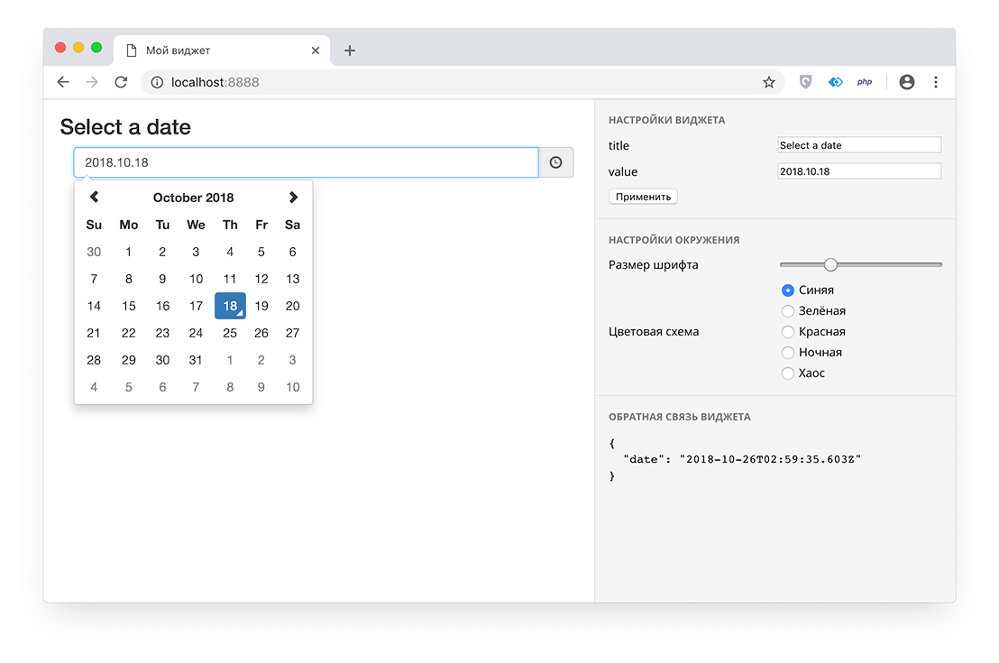

# Тестовое задание «Виджет»

Виджет — это часть оформления страницы сайта, чаще всего в виде прямоугольного блока.
Виджет состоит из HTML-кода и вспомогательных стилей и скриптов.
Конструктор сайтов собирает страницы из виджетов.

Нужно сделать виджет, в котором пользователь может выбрать дату в календаре.
Пример того, как может выглядеть приложение с виджетом:

## Как сделать виджет

1. Установить себе этот репозиторий:
    1. Убедиться, что у вас есть веб-сервер (Apache или Nginx), PHP версии 7 или новее и [Composer](http://getcomposer.org).
    2. Скачать исходных код из этого репозитория.
    3. Находясь в терминале в корне репозитория, выполнить `composer install`.
    4. Настроить веб-сервер так, чтобы запрос на корень сайта обрабатывался файлом `public/index.php`.
        Или просто открыть этот файл напрямую (например, http://localhost/public/index.php).
    
    Этот репозиторий — приложение, которое создаёт для виджета среду, похожую на конструктор сайта.
    Эта среда лишь эмулирует некоторые концепции окружения виджета в настоящем конструкторе, поэтому ваша работа не сможет быть использована в реальном проекте.
2. В директории `widget` создать файл `Widget.php` и написать в нём класс `Widget\Widget`, который реализует интерфейс `App\IWidget`.
    В эту директорию можно добавлять любые другие необходимые файлы. 
    В коде интерфейса написана подробная информация о том, какие методы и как нужно реализовывать.
3. Убедиться, что ваш виджет работает и соответствует требованиям, открыв установленное приложение в браузере.
4. Когда всё будет готово, отправить нам содержимое директории `widget`.

Помимо API на бэкэнде (PHP), виджету доступен API на фронтэнде:

* Можно окрашивать элементы виджета в цвета из цветовой схемы сайта, добавляя специальные классы тэгам:
    * `color-text`, `background-color-text`, `border-color-text` — окрашивают соответственно текст, фон и рамку в цвет основного текста;
    * `color-middle`, `background-color-middle`, `border-color-middle` — окрашивают в промежуточный цвет текста (между основным и фоновым);
    * `color-bg`, `background-color-bg`, `border-color-bg` — окрашивают в цвет фона;
    * `color-buttonText`, `background-color-buttonText`, `border-color-buttonText` — окрашивают в цвет текста кнопки;
    * `color-buttonBG`, `background-color-buttonBG`, `border-color-buttonBG` — окрашивают в цвет фона кнопки;
    * `color-link`, `background-color-link`, `border-color-link` — окрашивают в цвет ссылки;
* Чтобы выставить блоку стандартные отступы, добавьте ему класс `widget-padding`.
* Для увеличения веса селектора любого из классов API можно добавлять класс `enforce-selector`.
* Чтобы виджет отправил какое-нибудь значение приложению через JavaScript, нужно вызвать `app.setWidgetOutput('your value')`. 

## Требования

Функциональные:
* Виджет должен состоять из двух частей: заголовка и календаря для выбора даты.
    Календарь можно реализовать в любом форм-факторе (выпадающий, инлайновый и т.п.) с помощью любой библиотеки.
* В виджете должны настраиваться как минимум 2 параметра: заголовок (может быть пустым) и начальная выбранная дата.
    Формат списка настроек любой. То, как делать настройки, написано в PHP-коде.
* Когда пользователь выбирает дату, виджет должен отправить выбранную дату в приложение (см. информацию по API).
    Можно отправлять дату в любом формате.
* Виджет не должен влиять на поведение и оформление самого приложения.

Оформление:
* Виджет должен иметь стандартные отступы от краёв пространства для виджета (см. инфомацию по API).
* Виджет должен быть как можно больше окрашен в цвета цветовой схемы (см. инфомацию по API).
    Главное — окрасить цветные элементы.
* Как можно больше размеров элементов виджета должны бы указаны не жёстко (например, `10px`), а относительно размера шрифта приложения (например, `1em`),
    чтобы при изменении размера шрифта в интерфейсе приложения виджет масштабировался пропорционально.
* Виджет должен уметь адаптироваться под любую ширину экрана > 25em, занимая 100% доступного пространства по ширине
    (не учитывая всплывающие элементы).
* Красивое визуальное оформление не обязательно, но является плюсом.

Код:
* Аккуратный читаемый код является большим плюсом. Старайтесь следовать стилю, в котором написано приложение.
    В PHP это стандарт [PSR-2](https://www.php-fig.org/psr/psr-2/).
* Необходимые для виджета библиотеки желательно подключать из стороннего CDN, например, [jsDelivr](http://jsdelivr.com).
* Желательно подключать только минимально необходимый набор библиотек, чтобы виджет весил меньше.

Если есть вопросы по самому заданию, будем рады ответить.
